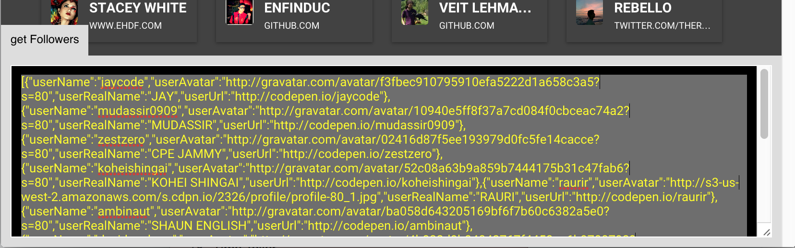

# codePen-devtools

## Get followers JSON

1. Got to `http://codepen.io/[USERNAME]/followers`
2. Click the button in the lower left corner
3. wait till the automation is done
4. copy the JSON from the output

